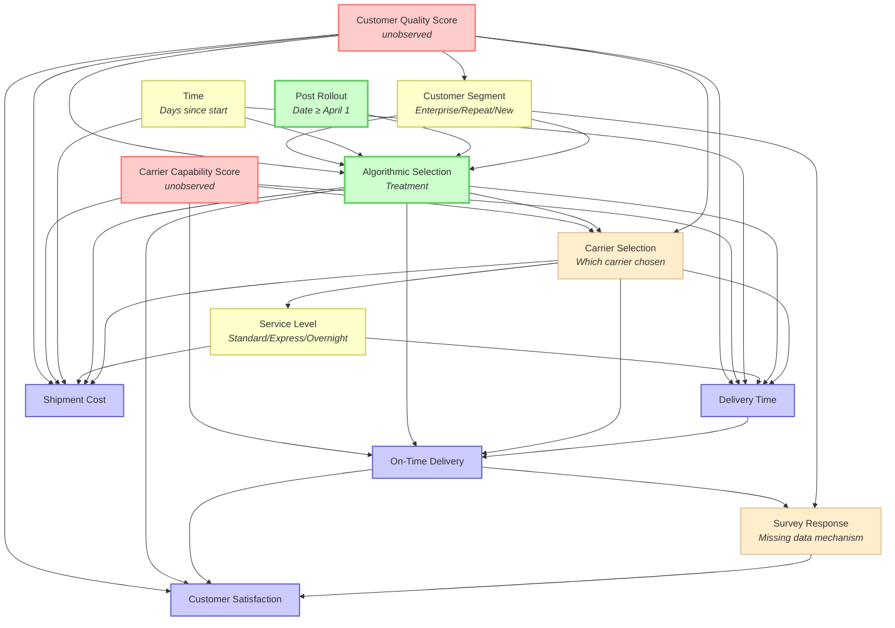

```mermaid
graph TD

%% Unobserved confounders (hidden variables)
CQ[Customer Quality Score<br/><i>unobserved</i>]
CC[Carrier Capability Score<br/><i>unobserved</i>]

%% Observable confounders
CS[Customer Segment<br/><i>Enterprise/Repeat/New</i>]
T[Time<br/><i>Days since start</i>]
SL[Service Level<br/><i>Standard/Express/Overnight</i>]

%% Treatment variables
PR[Post Rollout<br/><i>Date ≥ April 1</i>]
AS[Algorithmic Selection<br/><i>Treatment</i>]

%% Intermediate variables
CarrierSel[Carrier Selection<br/><i>Which carrier chosen</i>]

%% Outcome variables
DT[Delivery Time]
Cost[Shipment Cost]
OT[On-Time Delivery]
Sat[Customer Satisfaction]

%% Survey response mechanism
SR[Survey Response<br/><i>Missing data mechanism</i>]

%% Confounding paths (create bias)
CQ --> CS
CQ --> AS
CQ --> DT
CQ --> Cost
CQ --> Sat

CC --> CarrierSel
CC --> DT
CC --> Cost
CC --> OT

CS --> AS
T --> AS
T --> DT
T --> Cost

PR --> AS
CS --> AS

AS --> CarrierSel
CQ --> CarrierSel

SL --> DT
SL --> Cost
CarrierSel --> SL

AS --> DT
AS --> Cost
AS --> OT
AS --> Sat

CarrierSel --> DT
CarrierSel --> Cost
CarrierSel --> OT

OT --> Sat
DT --> OT

OT --> SR
CS --> SR
SR --> Sat

%% Styling
classDef unobserved fill:#ffcccc,stroke:#ff6666,stroke-width:2px
classDef treatment fill:#ccffcc,stroke:#66cc66,stroke-width:3px
classDef outcome fill:#ccccff,stroke:#6666cc,stroke-width:2px
classDef confounder fill:#ffffcc,stroke:#cccc66,stroke-width:2px
classDef mechanism fill:#ffeecc,stroke:#cc9966,stroke-width:1px

class CQ,CC unobserved
class AS,PR treatment
class DT,Cost,OT,Sat outcome
class CS,T,SL confounder
class CarrierSel,SR mechanism
```
