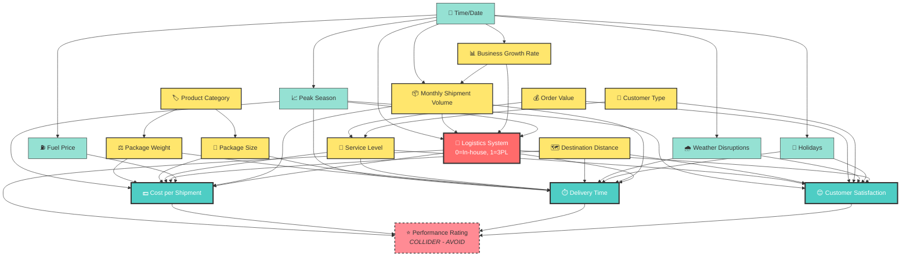

```mermaid
graph TD
    %% External/Exogenous Variables
    Time[📅 Time/Date]
    Weather[🌧️ Weather Disruptions]
    FuelPrice[⛽ Fuel Price]
    Holiday[🎄 Holidays]
    PeakSeason[📈 Peak Season]
    
    %% Business Context Variables
    BusinessGrowth[📊 Business Growth Rate]
    MonthlyVolume[📦 Monthly Shipment Volume]
    
    %% Shipment Characteristics
    PackageWeight[⚖️ Package Weight]
    PackageSize[📐 Package Size]
    ServiceLevel[🚀 Service Level]
    Distance[🗺️ Destination Distance]
    OrderValue[💰 Order Value]
    CustomerType[👥 Customer Type]
    ProductCategory[🏷️ Product Category]
    
    %% Treatment Variable
    Treatment[🔄 Logistics System<br/>0=In-house, 1=3PL]
    
    %% Outcome Variables
    Cost[💵 Cost per Shipment]
    DeliveryTime[⏱️ Delivery Time]
    Satisfaction[😊 Customer Satisfaction]
    
    %% Collider Variables (to avoid)
    PerfRating[⭐ Performance Rating<br/><i>COLLIDER - AVOID</i>]
    
    %% Time influences everything
    Time --> Weather
    Time --> FuelPrice
    Time --> Holiday
    Time --> PeakSeason
    Time --> BusinessGrowth
    Time --> MonthlyVolume
    Time --> Treatment
    
    %% Business growth drives treatment decision
    BusinessGrowth --> MonthlyVolume
    MonthlyVolume --> Treatment
    BusinessGrowth --> Treatment
    
    %% Seasonal patterns affect treatment timing and outcomes
    PeakSeason --> Treatment
    PeakSeason --> Cost
    PeakSeason --> DeliveryTime
    PeakSeason --> Satisfaction
    
    %% Shipment characteristics affect outcomes
    PackageWeight --> Cost
    PackageWeight --> DeliveryTime
    PackageSize --> Cost
    PackageSize --> DeliveryTime
    ServiceLevel --> Cost
    ServiceLevel --> DeliveryTime
    ServiceLevel --> Satisfaction
    Distance --> Cost
    Distance --> DeliveryTime
    Distance --> Satisfaction
    
    %% Business context affects outcomes
    OrderValue --> ServiceLevel
    OrderValue --> Satisfaction
    CustomerType --> ServiceLevel
    CustomerType --> Satisfaction
    ProductCategory --> PackageWeight
    ProductCategory --> PackageSize
    
    %% External factors affect outcomes
    Weather --> DeliveryTime
    Weather --> Satisfaction
    FuelPrice --> Cost
    Holiday --> DeliveryTime
    Holiday --> Satisfaction
    
    %% Volume affects outcomes (economies of scale)
    MonthlyVolume --> Cost
    MonthlyVolume --> DeliveryTime
    
    %% Main causal relationships (TREATMENT EFFECTS)
    Treatment --> Cost
    Treatment --> DeliveryTime
    Treatment --> Satisfaction
    
    %% Collider relationships (variables caused by treatment + outcomes)
    Treatment --> PerfRating
    Cost --> PerfRating
    DeliveryTime --> PerfRating
    Satisfaction --> PerfRating
    
    %% Styling
    classDef treatment fill:#ff6b6b,stroke:#333,stroke-width:3px,color:#fff
    classDef outcome fill:#4ecdc4,stroke:#333,stroke-width:3px,color:#fff
    classDef confounder fill:#ffe66d,stroke:#333,stroke-width:2px
    classDef collider fill:#ff8b94,stroke:#333,stroke-width:2px,stroke-dasharray: 5 5
    classDef exogenous fill:#95e1d3,stroke:#333,stroke-width:1px
    
    class Treatment treatment
    class Cost,DeliveryTime,Satisfaction outcome
    class BusinessGrowth,MonthlyVolume,PackageWeight,PackageSize,ServiceLevel,Distance,OrderValue,CustomerType,ProductCategory confounder
    class PerfRating collider
    class Time,Weather,FuelPrice,Holiday,PeakSeason exogenous
```
