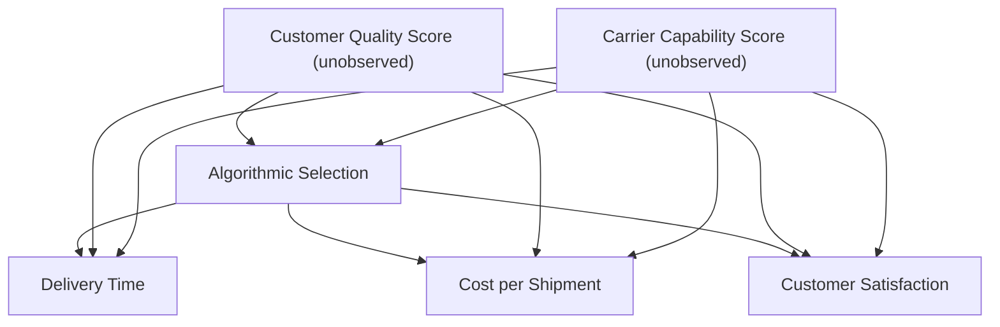

```mermaid
graph TD
    U1["Customer Quality Score (unobserved)"] --> AS[Algorithmic Selection]
    U2["Carrier Capability Score (unobserved)"] --> AS

    AS --> Y1["Delivery Time"]
    AS --> Y2["Cost per Shipment"]
    AS --> Y3["Customer Satisfaction"]

    U1 --> Y1
    U1 --> Y2
    U1 --> Y3
    U2 --> Y1
    U2 --> Y2
    U2 --> Y3
```
