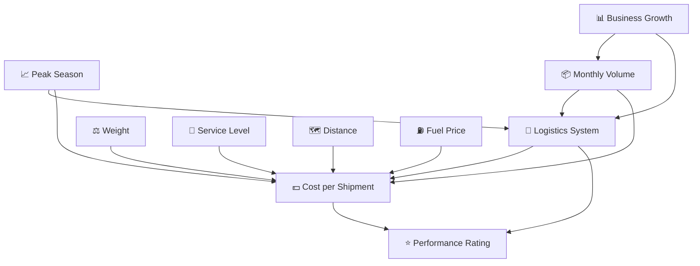
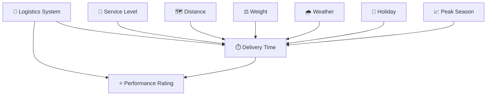

```mermaid
graph TD
    Treatment[🔄 Logistics System]
    Cost[💵 Cost per Shipment]
    
    %% Key Confounders (affect BOTH treatment and outcome)
    PeakSeason[📈 Peak Season]
    MonthlyVolume[📦 Monthly Volume]
    BusinessGrowth[📊 Business Growth]
    
    %% Direct Cost Confounders (affect only outcome)
    PackageWeight[⚖️ Weight]
    ServiceLevel[🚀 Service Level]  
    Distance[🗺️ Distance]
    FuelPrice[⛽ Fuel Price]
    
    %% Collider
    Performance[⭐ Performance Rating]
    
    %% CONFOUNDING PATHS (must control for these)
    BusinessGrowth --> MonthlyVolume
    BusinessGrowth --> Treatment
    MonthlyVolume --> Treatment
    MonthlyVolume --> Cost
    PeakSeason --> Treatment
    PeakSeason --> Cost
    
    %% DIRECT EFFECTS ON COST (control for precision)
    PackageWeight --> Cost
    ServiceLevel --> Cost
    Distance --> Cost
    FuelPrice --> Cost
    
    %% CAUSAL EFFECT OF INTEREST
    Treatment --> Cost
    
    %% COLLIDER (don't control)
    Treatment --> Performance
    Cost --> Performance
```

```mermaid
graph TD
    Treatment[🔄 Logistics System]
    Time[⏱️ Delivery Time]

    %% Confounders
    ServiceLevel[🚀 Service Level]
    Distance[🗺️ Distance]
    PackageWeight[⚖️ Weight]
    Weather[🌧️ Weather]
    Holiday[🎄 Holiday]
    PeakSeason[📈 Peak Season]

    %% Collider (avoid)
    Performance[⭐ Performance Rating]

    %% Arrows
    Treatment --> Time
    ServiceLevel --> Time
    Distance --> Time
    PackageWeight --> Time
    Weather --> Time
    Holiday --> Time
    PeakSeason --> Time

    %% Collider Path
    Treatment --> Performance
    Time --> Performance
```
